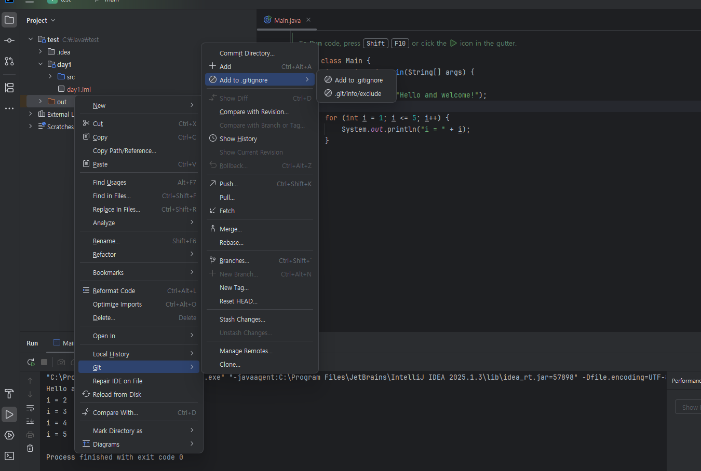
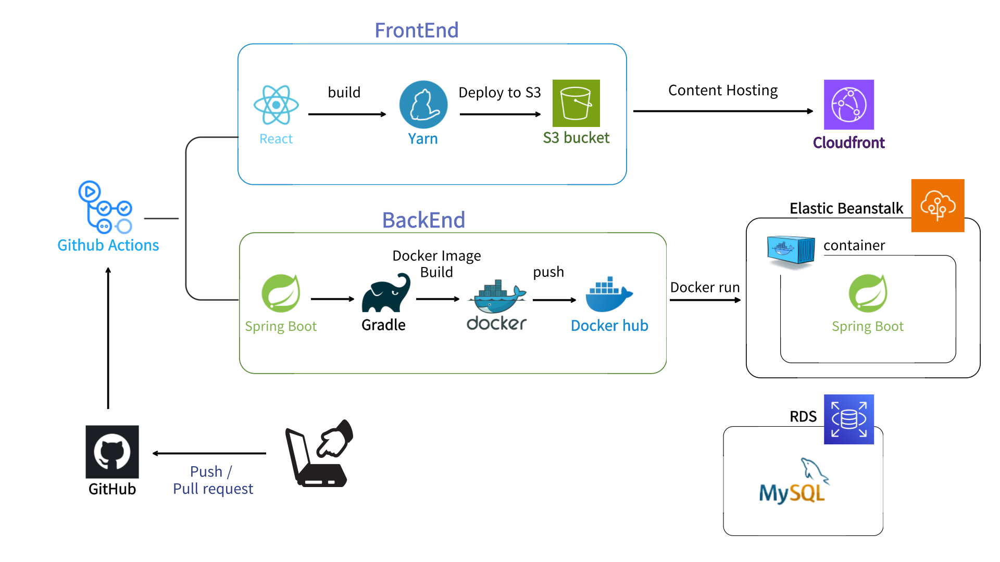
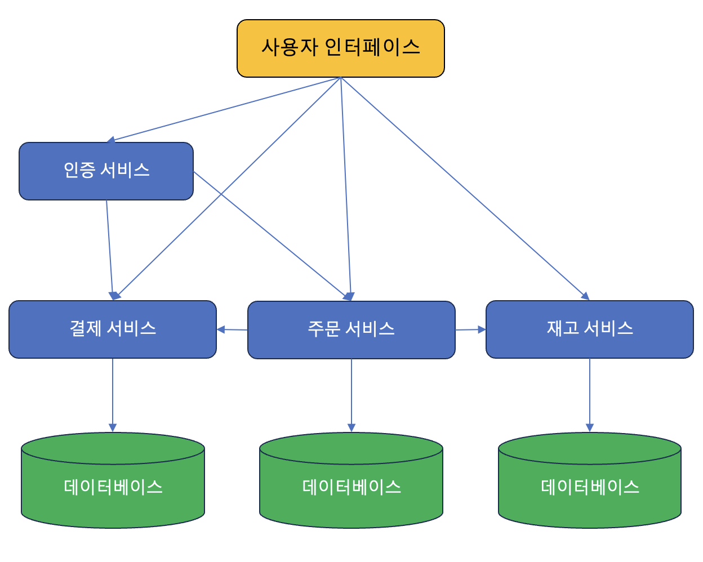

# JAVA


## ✅글머리
- 첫 번째 
- 두 번째 
- 세 번째 
- 네 번째
- <span style="color:red">이 글자는 빨간색</span>
- <span style="color:blue">이 글자는 파랑색</span>
- <span style="color:yellow">이 글자는 노랑색</span>
 ---

## ✅commit정리


## ✅시스템 아키텍처


---
## ✏️7월 1일 정리
➡️ [Intelij + Github 연동 블로그](https://try-nam.tistory.com/entry/IntelliJ-Github-IntelliJ-Github-%EC%97%B0%EB%8F%99%ED%95%98%EA%B8%B0)

➡️ [Github유튜브참고](https://www.youtube.com/watch?v=Fley6IFhlC8)

---

## 📂 git명령어 정리

| 명령어                    | 설명                       |
| ---------------------- | ------------------------ |
| `git checkout -b 브랜치명` | 새 브랜치 생성 및 이동            |
| `git merge 브랜치명`       | 현재 브랜치에 다른 브랜치 내용 병합     |
| `git rebase 브랜치명`      | 병합 대신 히스토리를 깔끔하게 재정렬     |
| `git push origin 브랜치명` | 원격 저장소에 브랜치 업로드          |
| `git pull origin main` | 원격 `main` 브랜치 최신 내용 가져오기 |


---

## ✅시스템정리

<details>
  <summary>토글 제목 (클릭해서 펼치기/접기)</summary>

### 토글 안에 들어갈 내용입니다.

- ### 목록

- ### intelij


- ### 아키텍처구상도



</details>

---
# ✅ 파일 다운로드

- [설치 가이드 PDF](./docs/install_guide.pdf)
- [샘플 데이터 CSV](./data/sample_data.csv)
- [외부 다운로드 링크](https://example.com/download.zip)

---

# ✅JAVA코드

```java
public class Hello {
  public static void main(String[] args) {
    System.out.println("Hello, Markdown!");
  }
}

